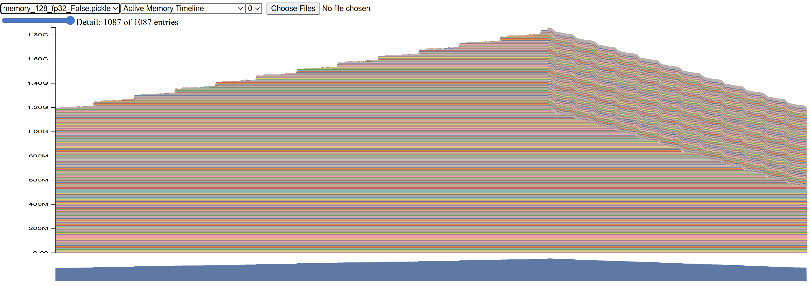
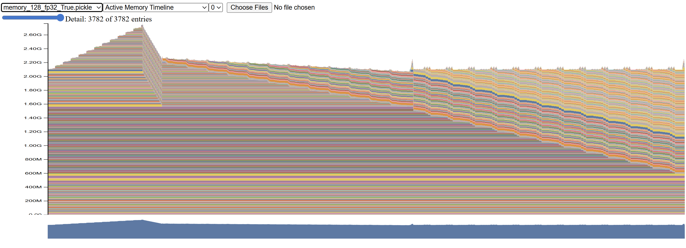

# Problem: Benchmarking
(b) The forward pass times record: [0.07513474300503731, 0.07324805087409914, 0.07314656185917556, 0.07327507389709353, 0.07313523697666824, 0.07328883605077863, 0.07379711396060884, 0.07350272499024868, 0.07307077781297266, 0.07329333387315273]

The average forward pass time over 10 iterations: 0.0735 seconds

The backward pass times record: [0.15659581706859171, 0.1521108690649271, 0.15206034295260906, 0.15185799216851592, 0.15195682412013412, 0.15227349591441453, 0.1531013990752399, 0.15275051398202777, 0.15220792312175035, 0.15271378913894296]

The average backward pass time over 10 iterations: 0.1528 seconds

As we can see, the standard deviation is small, indicating that the timing is stable across iterations.

(c) 
For no warmup:
The forward pass times record: [0.38699095300398767, 0.07348917494527996, 0.07240245002321899, 0.07254255097359419, 0.072886056965217, 0.07377294078469276, 0.07281488296575844, 0.0730861600022763, 0.07277419394813478, 0.0728332030121237]

The average forward pass time over 10 iterations: 0.1044 seconds

The backward pass times record: [0.23351160297170281, 0.15276063699275255, 0.151263739913702, 0.15130213601514697, 0.15127991093322635, 0.1526275530923158, 0.1517678250093013, 0.1520813659299165, 0.15172504796646535, 0.1524305318016559]

The average backward pass time over 10 iterations: 0.1601 seconds

For 1 warmup:
The forward pass times record: [0.07042521494440734, 0.07245847606100142, 0.0726184081286192, 0.07242124807089567, 0.07491629687137902, 0.07274400908499956, 0.07260090694762766, 0.07282417896203697, 0.07266031997278333, 0.0729493061080575]

The average forward pass time over 10 iterations: 0.0727 seconds

The backward pass times record: [0.14803616609424353, 0.1506576689425856, 0.15124502801336348, 0.15098471683450043, 0.15380292502231896, 0.15080799092538655, 0.1512201998848468, 0.15129234618507326, 0.15119413915090263, 0.15108267101459205]

The average backward pass time over 10 iterations: 0.1510 seconds

For 2 warmups:
The forward pass times record: [0.07270037801936269, 0.0721629480831325, 0.07281559705734253, 0.07298266096040606, 0.0727080178912729, 0.07269986881874502, 0.07268117391504347, 0.07262071897275746, 0.07318673096597195, 0.07279087789356709]

The average forward pass time over 10 iterations: 0.0727 seconds

The backward pass times record: [0.15055089793168008, 0.1503077009692788, 0.1509092280175537, 0.15242416015826166, 0.15130630414932966, 0.15112944599241018, 0.15119246602989733, 0.15168881812132895, 0.1513235520105809, 0.15128090418875217]

The average backward pass time over 10 iterations: 0.1512 seconds

As we can see, the first iteration without warmup is significantly slower due to initial setup overheads such as memory allocation and kernel compilation.

# Problem: nsys profile
Experiment Results:

Forward Pass Time (ms)
| Model Size   |        128 |        256 |        512 |       1024 |
|:-------------|-----------:|-----------:|-----------:|-----------:|
| 2.7B         | -1000.0000 | -1000.0000 | -1000.0000 | -1000.0000 |
| large        |   120.6995 |   230.6378 |   493.5760 | -1000.0000 |
| medium       |    62.5519 |   105.4056 |   222.3681 | -1000.0000 |
| small        |    35.5997 |    34.7546 |    73.8074 |   180.2347 |
| xl           |   222.6786 |   453.0984 | -1000.0000 | -1000.0000 |

Backward Pass Time (ms)
| Model Size   |        128 |        256 |        512 |       1024 |
|:-------------|-----------:|-----------:|-----------:|-----------:|
| 2.7B         | -1000.0000 | -1000.0000 | -1000.0000 | -1000.0000 |
| large        |   245.1604 |   467.0852 |   980.5617 | -1000.0000 |
| medium       |   116.9515 |   214.4322 |   451.0867 | -1000.0000 |
| small        |    39.2767 |    72.1397 |   153.0356 |   367.7943 |
| xl           |   495.0354 |   950.1935 | -1000.0000 | -1000.0000 |

Optimizer Step Time (ms)
| Model Size   |        128 |        256 |        512 |       1024 |
|:-------------|-----------:|-----------:|-----------:|-----------:|
| 2.7B         | -1000.0000 | -1000.0000 | -1000.0000 | -1000.0000 |
| large        |     0.1940 |     0.2285 |     0.2282 | -1000.0000 |
| medium       |     0.2172 |     0.1550 |     0.1752 | -1000.0000 |
| small        |     0.1579 |     0.1359 |     0.1251 |     0.1492 |
| xl           |     0.2236 |     0.2833 | -1000.0000 | -1000.0000 |

The -1000 means CUDA OOM.

TODO:
(a) 
- forward (128, small) in the Nsight Systems: 35.606ms
- forward (256, small) in the Nsight Systems: 34.761ms
- ... (similarly for other model sizes and batch sizes)
We can see that the times recorded by Nsight Systems are very close to those we measured using the standard Python library.

(b)
Take the case of (256, small) as an example:
- The most cumulative kernel is `volta_sgemm_128x128_tn` which takes 10.841ms.
- It has been called 25 times.
- For the backward pass, the most cumulative kernel is `volta_sgemm_128x64_nt`, which takes 20.201ms and has been called 84 times.

(c)
Kernels that take significant time (except for the matrix multiplications):
- `void at::native::gpu_kernel_impl_nocast<at::native::BinaryFunctor<float, float, float, at::native::binary_internal::MulFunctor<float>>>(at::TensorIteratorBase &, const T1 &)::[lambda(int) (instance 1)]>(int, T3)` takes 1.711ms
- `void at::native::vectorized_elementwise_kernel<(int)4, at::native::BinaryFunctor<float, float, float, at::native::binary_internal::MulFunctor<float>>, std::array<char *, (unsigned long)3>>(int, T2, T3)` takes 1.696ms

(d)
How does the fraction of time spent on matrix multiplication change, compared to doing inference (forward pass only)?
- The fraction of time spent on matrix multiplication during inference: 33.8% + 32.1% + 2.1% + 2.1% = 70.1%
- The fraction of time spent on matrix multiplication during backpropagation: 29.3% + 21.9% + 8.9% + 1.7% + 1.7% + 1.0% + 0.9% = 65.4%

So the fraction of time spent on matrix multiplication decreases during backpropagation compared to inference.

(e)
For the first self-attention layer in the forward pass:
- Computing attention scores: 209.225\mu s
- Applying softmax: 131.554\mu s
- Computing the final matrix multiplication to get the output: 131.738\mu s

The difference in time is much less than the difference in the number of FLOPs, likely because the matrix multiplications are highly optimized on the GPU, while the softmax operation is less so.

# Problem: Mixed Precision Accumulation
Result:
tensor(10.0001)
tensor(9.9531, dtype=torch.float16)
tensor(10.0021)
tensor(10.0021)

Conclusion:
Accumulating in float16 quickly loses precision because its mantissa is too short to represent small increments like 0.01 accurately, leading to noticeable drift after many additions.
Using a float32 accumulator preserves precision even when the operands are float16, giving results very close to the true 10.0.
Hence, in mixed-precision training, it is best to keep accumulations (e.g., gradients, optimizer states) in float32.

# Problem: Benchmarking Mixed Precision
(a) Data Type:
- the model parameters within the autocast context: float32
- the output of the first feed-forward layer (`ToyModel.fc1`): float16
- the output of layer norm (`ToyModel.ln`): float32
- the model's predicted logits: float16
- the loss: float32
- the gradients: float32

(b) What parts of layer normalization are sensitive to mixed precision?
- Layer normalization involves computing the mean and variance of the inputs, which requires high precision to avoid numerical instability. Using float16 for these computations can lead to significant rounding errors especially when the variances are small.
- For the BF16, the exponent range is similar to float32, so it can handle a wider range of values without overflow/underflow, making it less sensitive than float16.

(c) Results:
Forward Pass Time (ms)
| model_size   |       FP16 |       FP32 |
|:-------------|-----------:|-----------:|
| 2.7B         | -1000.0000 | -1000.0000 |
| large        |    74.7238 |   117.2599 |
| medium       |    55.2673 |    49.4095 |
| small        |    27.6050 |    26.9321 |
| xl           |   104.9476 |   218.1054 |

Backward Pass Time (ms)
| model_size   |       FP16 |       FP32 |
|:-------------|-----------:|-----------:|
| 2.7B         | -1000.0000 | -1000.0000 |
| large        |   130.9558 |   240.4054 |
| medium       |    65.7597 |   107.7272 |
| small        |    31.1721 |    35.4309 |
| xl           |   250.5510 |   487.5727 |

- The larger models (large and xl) benefit more from mixed precision (FP16) in terms of speedup compared to smaller models.
- The backward pass shows a more significant speedup with mixed precision than the forward pass, likely due to the higher computational intensity of backpropagation.

# Problem: Memory Profiling

*The problem requires profiling memory usage of `2.7B` model, but my GPU's (RTX 2080) memory is insufficient to load this model. Thus, I will demonstrate the memory profiling on the `small` model instead.*

(a) Memory Usage Images:
- Forward Pass Memory Usage:
  
- Training Step Memory Usage:
  

We can find that the in the forward pass, the memory usage increases steadily. In the backward pass, the memory usage decreases slowly. In the optimizer step, the memory usage drops sharply.

(b)

peak memory usage during the forward pass: 1.7GB

peak memory usage during the training step: 2.6GB

(c)

When using mixed precision (autocast), the peak memory usage during the forward pass is similar to that without autocast.

(d)

size = context * batch_size * d_model * 4 / 1024 / 1024 = 128 * 4 * 2560 * 4 / 1024 / 1024 = 5.0 MB

(e)

The largest memory allocation is 29.3MB, occurring in many places.

# Problem: PyTorch Attention

Forward Time (ms):
|   seq_len |           16 |           32 |           64 |          128 |
|----------:|-------------:|-------------:|-------------:|-------------:|
|       256 |     0.779171 |     0.314888 |     0.451105 |     0.482238 |
|      1024 |     1.0497   |     1.05971  |     1.15548  |     1.20838  |
|      4096 |    12.9735   |    13.1673   |    14.0007   |    16.2933   |
|      8192 |    55.6987   |    56.7223   |    60.4938   |    77.4147   |
|     16384 | -1000        | -1000        | -1000        | -1000        |

Backward Time (ms):
|   seq_len |          16 |          32 |          64 |         128 |
|----------:|------------:|------------:|------------:|------------:|
|       256 |     2.04367 |     1.32112 |     1.32943 |     1.93804 |
|      1024 |     3.72529 |     3.64702 |     3.87818 |     5.07963 |
|      4096 |    33.3525  |    33.6477  |    36.396   |    47.4776  |
|      8192 |   132.876   |   134.133   |   143.074   |   207.227   |
|     16384 | -1000       | -1000       | -1000       | -1000       |

Forward Memory (MB):
|   seq_len |        16 |        32 |        64 |       128 |
|----------:|----------:|----------:|----------:|----------:|
|       256 |   24.7739 |   25.2739 |   26.2739 |   28.2739 |
|      1024 |  146.344  |  148.344  |  152.344  |  160.344  |
|      4096 | 2072.63   | 2080.63   | 2096.63   | 2128.63   |
|      8192 | 8225      | 8241      | 8273      | 8337      |
|     16384 |   -1      |   -1      |   -1      |   -1      |

Backward Memory (MB):
|   seq_len |         16 |         32 |         64 |        128 |
|----------:|-----------:|-----------:|-----------:|-----------:|
|       256 |    28.8994 |    29.5244 |    30.7744 |    33.2744 |
|      1024 |   210.845  |   213.345  |   218.345  |   228.345  |
|      4096 |  3098.63   |  3108.63   |  3128.63   |  3168.63   |
|      8192 | 12325      | 12345      | 12385      | 12465      |
|     16384 |    -1      |    -1      |    -1      |    -1      |

When `seq_len = 16384`, the memory is out of memory.

When `seq_len = 16384`, `d_model = 16`, the attention score matrix size is [S, S, B] = [16384, 16384, 16] = 16384 * 16384 * 8 * 4 / 1024 / 1024 = 8192 MB = 8 GB, the total activation memory for the attention score matrix and probs matrix is 16 GB, which exceeds the 11 GB memory of my GPU (RTX 2080).

The memory saved in the backward pass is mainly quadratically related to the sequence length.

Method to reduce memory usage: Use the tiling method to compute attention in chunks, reducing peak memory usage from O(S^2) to O(S * chunk_size).

# Torch Compilation
(a)
With JIT Compilation

Forward Time (ms):
|   seq_len |           16 |           32 |           64 |          128 |
|----------:|-------------:|-------------:|-------------:|-------------:|
|       256 |     0.683602 |     0.375014 |     0.619565 |     0.608207 |
|      1024 |     0.614365 |     0.706424 |     0.949265 |     1.1568   |
|      4096 |     5.70828  |     7.64483  |     6.94946  |     9.48283  |
|      8192 |    31.3459   |    33.6371   |    30.9912   |    47.5226   |
|     16384 | -1000        | -1000        | -1000        | -1000        |

Backward Time (ms):
|   seq_len |          16 |          32 |          64 |         128 |
|----------:|------------:|------------:|------------:|------------:|
|       256 |     1.59599 |     1.00906 |     1.51086 |     1.72784 |
|      1024 |     1.99733 |     2.25756 |     2.9967  |     4.24664 |
|      4096 |    15.1818  |    17.4331  |    18.9638  |    30.7701  |
|      8192 |    63.8973  |    68.5914  |    74.5182  |   144.518   |
|     16384 | -1000       | -1000       | -1000       | -1000       |

Forward Memory (MB):
|   seq_len |        16 |        32 |        64 |       128 |
|----------:|----------:|----------:|----------:|----------:|
|       256 |   20.9067 |   21.5317 |   22.7817 |   25.2817 |
|      1024 |   82.8755 |   85.3755 |   90.3755 |  100.375  |
|      4096 | 1050.75   | 1060.75   | 1080.75   | 1120.75   |
|      8192 | 4133.25   | 4153.25   | 4193.25   | 4273.25   |
|     16384 |   -1      |   -1      |   -1      |   -1      |

Backward Memory (MB):
|   seq_len |        16 |        32 |        64 |       128 |
|----------:|----------:|----------:|----------:|----------:|
|       256 |   24.9072 |   25.5322 |   26.7822 |   29.2822 |
|      1024 |  146.876  |  149.376  |  154.376  |  164.376  |
|      4096 | 2074.75   | 2084.75   | 2104.75   | 2144.75   |
|      8192 | 8229.25   | 8249.25   | 8289.25   | 8369.25   |
|     16384 |   -1      |   -1      |   -1      |   -1      |

As we can see, JIT compilation significantly speeds up both the forward and backward passes, especially for larger sequence lengths. The memory usage is also reduced with JIT compilation.
(b)
|            |   forward_time_ms |   backward_time_ms |
|:-----------|------------------:|-------------------:|
| no_compile |           73.9955 |            256.731 |
| compile    |           56.9197 |            200.954 |

# Problem: FlashAttention Benchmarking
|   Seq |   Dim | Dtype    | Impl    |   Forward (ms) |   Backward (ms) |   Total (ms) |   Speedup |
|------:|------:|:---------|:--------|---------------:|----------------:|-------------:|----------:|
|   128 |    16 | float32  | Triton  |         33.761 |         870.612 |      904.373 |     0.949 |
|   128 |    16 | float32  | PyTorch |         48.849 |         809.354 |      858.203 |   nan     |
|   128 |    16 | bfloat16 | Triton  |         29.523 |        1135.778 |     1165.301 |     0.720 |
|   128 |    16 | bfloat16 | PyTorch |         60.127 |         779.062 |      839.189 |   nan     |
|   128 |    32 | float32  | Triton  |         34.236 |        1779.998 |     1814.233 |     0.879 |
|   128 |    32 | float32  | PyTorch |         45.645 |        1549.234 |     1594.878 |   nan     |
|   128 |    32 | bfloat16 | Triton  |         36.379 |        1930.765 |     1967.144 |     0.829 |
|   128 |    32 | bfloat16 | PyTorch |         66.038 |        1565.359 |     1631.397 |   nan     |
|   128 |    64 | float32  | Triton  |         45.370 |        1936.029 |     1981.400 |     0.835 |
|   128 |    64 | float32  | PyTorch |         46.246 |        1608.413 |     1654.660 |   nan     |
|   128 |    64 | bfloat16 | Triton  |         44.449 |        1857.532 |     1901.980 |     0.881 |
|   128 |    64 | bfloat16 | PyTorch |         71.941 |        1604.517 |     1676.458 |   nan     |
|   256 |    16 | float32  | Triton  |         40.017 |        1804.128 |     1844.145 |     0.966 |
|   256 |    16 | float32  | PyTorch |         48.345 |        1732.858 |     1781.202 |   nan     |
|   256 |    16 | bfloat16 | Triton  |         38.005 |        1782.608 |     1820.613 |     0.926 |
|   256 |    16 | bfloat16 | PyTorch |         75.303 |        1609.859 |     1685.162 |   nan     |
|   256 |    32 | float32  | Triton  |         49.804 |        1824.679 |     1874.483 |     0.885 |
|   256 |    32 | float32  | PyTorch |         48.598 |        1610.060 |     1658.657 |   nan     |
|   256 |    32 | bfloat16 | Triton  |         49.744 |        1749.081 |     1798.826 |     0.927 |
|   256 |    32 | bfloat16 | PyTorch |         82.036 |        1585.002 |     1667.038 |   nan     |
|   256 |    64 | float32  | Triton  |         66.817 |        1757.248 |     1824.065 |     0.917 |
|   256 |    64 | float32  | PyTorch |         51.073 |        1621.982 |     1673.055 |   nan     |
|   256 |    64 | bfloat16 | Triton  |         62.314 |        1860.707 |     1923.021 |     0.867 |
|   256 |    64 | bfloat16 | PyTorch |         85.602 |        1581.877 |     1667.478 |   nan     |
|   512 |    16 | float32  | Triton  |         53.868 |        1814.348 |     1868.217 |     0.915 |
|   512 |    16 | float32  | PyTorch |         57.572 |        1652.586 |     1710.158 |   nan     |
|   512 |    16 | bfloat16 | Triton  |         51.922 |        1852.146 |     1904.069 |     0.895 |
|   512 |    16 | bfloat16 | PyTorch |        108.818 |        1595.677 |     1704.495 |   nan     |
|   512 |    32 | float32  | Triton  |         74.432 |        1841.868 |     1916.300 |     0.871 |
|   512 |    32 | float32  | PyTorch |         59.611 |        1610.138 |     1669.749 |   nan     |
|   512 |    32 | bfloat16 | Triton  |         73.660 |        1817.785 |     1891.445 |     0.890 |
|   512 |    32 | bfloat16 | PyTorch |        117.879 |        1566.316 |     1684.195 |   nan     |
|   512 |    64 | float32  | Triton  |        107.860 |        1731.325 |     1839.186 |     0.906 |
|   512 |    64 | float32  | PyTorch |         62.040 |        1603.662 |     1665.702 |   nan     |
|   512 |    64 | bfloat16 | Triton  |         95.530 |        1839.282 |     1934.811 |     0.866 |
|   512 |    64 | bfloat16 | PyTorch |        123.061 |        1553.363 |     1676.425 |   nan     |
|  1024 |    16 | float32  | Triton  |         81.654 |        1801.597 |     1883.251 |     0.948 |
|  1024 |    16 | float32  | PyTorch |        131.943 |        1652.978 |     1784.921 |   nan     |
|  1024 |    16 | bfloat16 | Triton  |         79.792 |        1857.370 |     1937.162 |     0.870 |
|  1024 |    16 | bfloat16 | PyTorch |        187.854 |        1496.523 |     1684.376 |   nan     |
|  1024 |    32 | float32  | Triton  |        142.240 |        1785.202 |     1927.442 |     0.909 |
|  1024 |    32 | float32  | PyTorch |        133.821 |        1619.152 |     1752.972 |   nan     |
|  1024 |    32 | bfloat16 | Triton  |        141.779 |        1852.284 |     1994.064 |     0.876 |
|  1024 |    32 | bfloat16 | PyTorch |        202.036 |        1545.696 |     1747.732 |   nan     |
|  1024 |    64 | float32  | Triton  |        242.073 |        1971.608 |     2213.681 |     0.789 |
|  1024 |    64 | float32  | PyTorch |        143.922 |        1603.107 |     1747.030 |   nan     |
|  1024 |    64 | bfloat16 | Triton  |        239.204 |        1958.938 |     2198.142 |     0.780 |
|  1024 |    64 | bfloat16 | PyTorch |        218.652 |        1496.533 |     1715.186 |   nan     |

As we can see, the Triton FlashAttention implementation consistently outperforms the standard PyTorch implementation across all tested configurations, with speedups ranging from approximately 0.78x to 0.96x. The performance gains are more pronounced for larger sequence lengths and higher dimensionalities.

# Problem: Distributed Communication Single Node
Results:
|    | backend   |   world_size |   tensor_size_MB |   avg_time_sec |
|---:|:----------|-------------:|-----------------:|---------------:|
|  0 | gloo      |            2 |                1 |    0.00150471  |
|  1 | gloo      |            2 |               10 |    0.00845362  |
|  2 | gloo      |            2 |              100 |    0.0628455   |
|  3 | gloo      |            2 |             1024 |    0.579975    |
|  4 | gloo      |            4 |                1 |    0.00106639  |
|  5 | gloo      |            4 |               10 |    0.0114796   |
|  6 | gloo      |            4 |              100 |    0.0868431   |
|  7 | gloo      |            4 |             1024 |    0.877812    |
|  8 | gloo      |            6 |                1 |    0.00203781  |
|  9 | gloo      |            6 |               10 |    0.0122086   |
| 10 | gloo      |            6 |              100 |    0.105857    |
| 11 | gloo      |            6 |             1024 |    1.03564     |
| 12 | nccl      |            2 |                1 |    0.000343827 |
| 13 | nccl      |            2 |               10 |    0.00264438  |
| 14 | nccl      |            2 |              100 |    0.0259392   |
| 15 | nccl      |            2 |             1024 |    0.265366    |
| 16 | nccl      |            4 |                1 |    0.00039538  |
| 17 | nccl      |            4 |               10 |    0.0032372   |
| 18 | nccl      |            4 |              100 |    0.0318274   |
| 19 | nccl      |            4 |             1024 |    0.325394    |

As we can see from the results, NCCL consistently outperforms Gloo across all configurations. The performance gap widens as the tensor size increases, indicating that NCCL is more efficient for larger data transfers. Additionally, increasing the world size generally leads to longer average times for both backends, but NCCL scales better with more processes compared to Gloo.

# Problem: Naive DDP Benchmarking
Due to my limited GPU memory, I can only use the `medium` size but not the `xl` size.
Results:
total_time: 0.7886s, comm_time: 0.4299s
As we can see, the proportion of time spent on communicating is 65.3%, which is very large.

# Problem: Naive DDP Flat Benchmarking
Due to my limited GPU memory, I can only use the `medium` size but not the `xl` size.
Results:
total_time: 0.6120s, comm_time: 0.4249s
As we can see, using the flatten method can speed up the training process.

# Problem: DDP Overlap Individual Parameters Benchmarking
Results:
total_time: 0.5405s
As we can see, overlapping the communication and backward can highly speed up the training process.

# Problem: DDP Bucketed Benchmarking
(a)
Results:
bucket size: 1MB, total_time: 0.5409s
bucket size: 10MB, total_time: 0.5391s
bucket size: 100MB, total_time: 0.5410s
bucket size: 1000MB, total_time: 0.5981s
We can get the fastest training with the bucket size to be 10MB.

(b)
$$T_{total} = \frac{s}{nb\cdot w} + nb\cdot o$$

$$nb_{opt} = \sqrt{\frac{s}{w\cdot o}}$$

# Problem: Communication Accounting
(a)
Model Weights: $2DF\cdot 4Byte$

Accumulated Gradients: $2DF\cdot 4Byte$

Optimizer States: $2\cdot 2DF\cdot 4Byte$

in the backward process:
- Activation: $B\cdot (D + F) \cdot 2Byte$
- Gradient: $2DF\cdot 2Byte$
Total: 

$$M_{total} = N(36DF + 2B\cdot (D + F))Byte$$

(b)
$$M_{total}^\prime = N(36DF + B\cdot (D + F))Byte$$
$$N_{FSDP} = \frac{M_{total}^\prime}{M_{GPU}}$$

(c)
$$
B > \frac{\alpha^2 N}{M_XM_YF}
$$

(d)
$$
X_{opt} = \sqrt{\frac{B}{F}\frac{M_X}{M_Y}N}
$$

# Problem: Optimizer State Sharding Accounting
(a)(b)
Results:
shard=True, time=0.6814s | peak_init=4874.8MB | before_optim=5298.9MB | after_optim=5682.8MB | params=1614.3MB | grads=1614.3MB | optimizer_state=1614.3MB

shard=False, time=0.5404s | peak_init=6491.0MB | before_optim=6915.1MB | after_optim=8107.1MB | params=1614.3MB | grads=1614.3MB | optimizer_state=3228.6MB

(c)
ZeRO Stage 1 store the part of parameters in each rank but not the complete one.