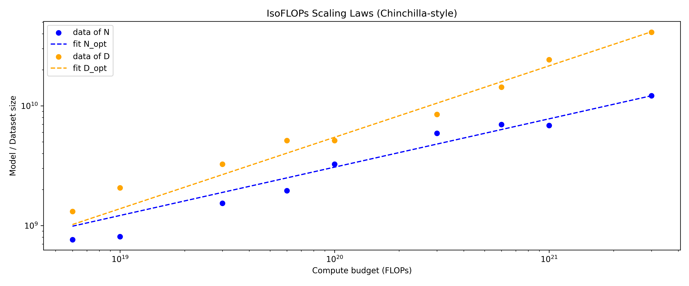

# Problem: Chinchilla Isoflops
Results:
Fitted N_opt = 2.579e+01 * C^0.404
Predicted N_opt(1e23) = 5.002e+10
Predicted N_opt(1e24) = 1.268e+11

Fitted D_opt = 6.338e-03 * C^0.597
Predicted D_opt(1e23) = 3.370e+11
Predicted D_opt(1e24) = 1.332e+12

# Problem: Scaling Laws
I don't have the VPN for Stanford, so I can only design the experiments, but can't conduct it.

- Given your fixed scaling laws budget of 2e18, how did you decide which runs to query?

I select several log-spaced compute budgets $C\in{\{10^{15},3\times10^{15},10^{16},3\times10^{16},10^{17}\}}$.

For each $C$, I evaluate five model sizes $N$ around a prior guess and fit a local quadratic to the $(N, \text{loss})$ points to approximate the “bowl”; the vertex gives $N_{\text{opt}}(C)$.

I then set $D_{\text{opt}}(C)=C/(6N_{\text{opt}}(C))$ and fit power laws $N_{\text{opt}}(C)=aC^{b}$ (and optionally $D_{\text{opt}}(C)=cC^{d}$) to extrapolate to $C=10^{19}$.

This strategy uses only five runs per compute level, keeps total FLOPs under the $2\times10^{18}$ cap, and yields a smooth $N_{\text{opt}}(C)$ curve for extrapolation.

